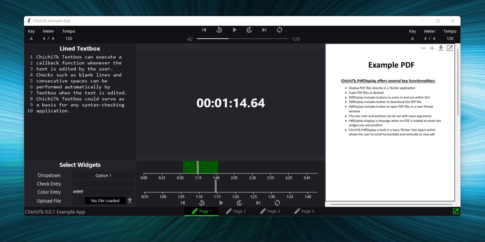

# ChichiTk

ChichiTk is a python UI library built upon Tkinter, which implements affectedly elegant extensions of existing tkinter widgets. Further description...


| _`example.py` on Windows_

**video here**
| _`example.py` on Windows - sample user interactions_

## Installation
Install the module with pip:
```
pip3 install chichitk
```
Update existing installation:
```
pip3 install chichitk --upgrade
```
Update as often as possible because this library is under active development.

## Documentation
The **official** documentation can be found in the Wiki Tab here:

**--> [ChichiTk Documentation](https://github.com/SamGibson1/ChichiTk/wiki)**

## Example Program
The following is a simple Stopwatch program that uses chichitk.Player to manage callbacks:
```python
from tkinter import Tk, Frame

# code here

```
This results in the following window on Windows:


## Sample Application - Password Manager
Video here showing password manager and link to git repo for password manager
